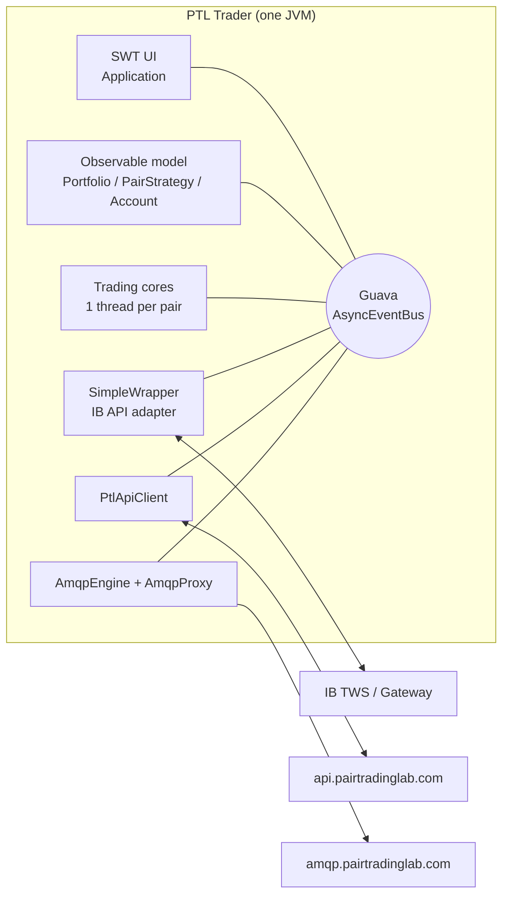
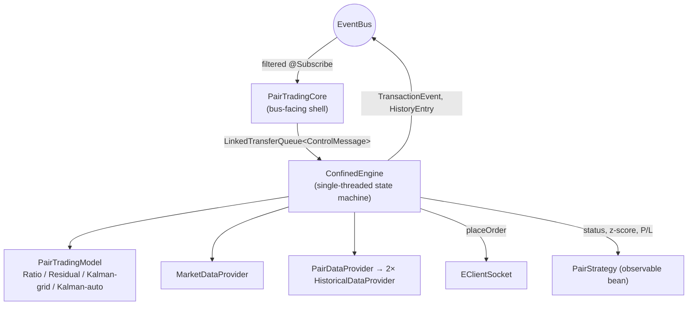
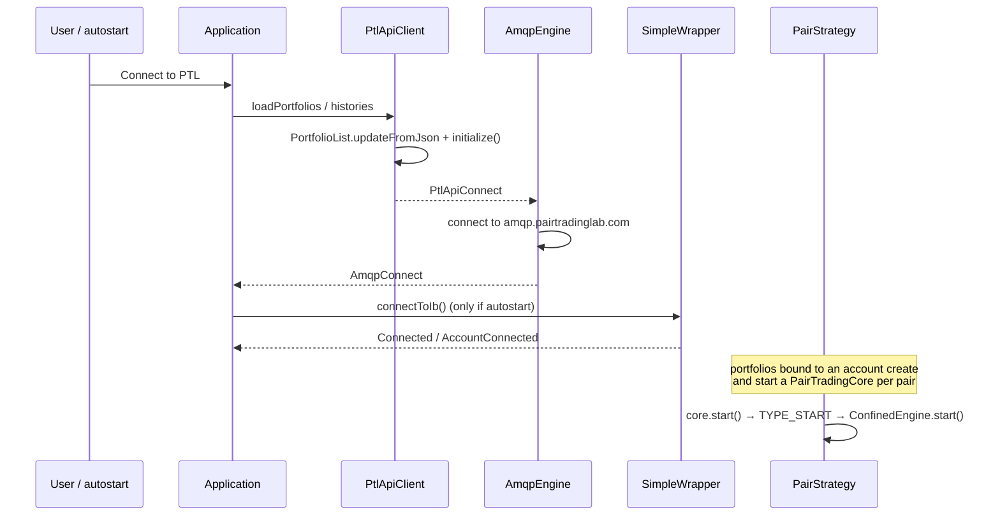

# PTL Trader — Architecture

This document describes how PTL Trader is put together: its runtime topology, the
components it is built from, the threading model, and the flows that connect them.
For build instructions, configuration keys, external interface details and a
model-by-model reference, see [TECHNICAL.md](TECHNICAL.md).

All code references use `path:line`-style package/class names from
`src/main/java/com/pairtradinglab/ptltrader`.

---

## 1. What the application is

PTL Trader is a **single-process, single-user desktop application** that runs
automated pair-trading strategy portfolios against an Interactive Brokers account.
It is not a server: there is no embedded database, no scheduler daemon and no
inter-process API. All persistent strategy state lives on the Pair Trading Lab
(PTL) servers; the application holds an in-memory working copy and synchronises it
back.

Three external systems bound the design:

| System | Protocol | Purpose |
|---|---|---|
| IB Trader Workstation / IB Gateway | IB API over TCP (`EClientSocket` / `EWrapper`) | market data, historical bars, account & position updates, order submission |
| Pair Trading Lab REST API | HTTPS + HTTP Basic auth | load portfolios/strategies/histories, push back mutated strategy state |
| Pair Trading Lab event bus | AMQP over TLS (RabbitMQ) | telemetry: trades, transactions, P/L, heartbeat/monitoring |

The application must keep running unattended for weeks with real money at stake, so
the architecture is built around three recurring themes: **thread confinement of
trading state**, **defensive reconciliation against IB**, and **fail-to-safe**
(when in doubt, stop trading and ask a human).



---

## 2. Layers and packages

The code is organised by responsibility rather than by feature.

| Package | Role |
|---|---|
| `com.pairtradinglab.ptltrader` | Application entry point, DI wiring, cross-cutting infrastructure (`Beacon`, `SystemMonitor`, `LoggerFactoryImpl`, `ActiveCores`, `RuntimeParams`, `StringXorProcessor`), PTL REST client, AMQP engine and proxy |
| `…​.events` | Application-level events posted on the bus (connection state, log lines, sync-out requests, monitoring) |
| `…​.model` | Observable domain beans: `PortfolioList`, `Portfolio`, `PairStrategy`, `Position`, `Account`/`AccountList`, `Settings`, `Status`, `TradeHistory`, `LegHistory`, `LogEntryList` — plus JFace `converter`/`validator` helpers |
| `…​.ib` | IB API adapter: `SimpleWrapper` (implements `EWrapper`), `HistoricalDataRequest` |
| `…​.trading` | The trading engine: `PairTradingCore`, `ConfinedEngine`, the `PairTradingModel` family, data providers, `ActivityDetector`, `ContractExt`, `CoreStatus` |
| `…​.trading.events` | Events emitted by / consumed by the trading layer (ticks, order status, executions, transactions, history entries) |
| `…​.trading.kernelfx` | Self-contained numerical kernel for the Kalman models: sub-models, rolling statistic cells, simulated strategies, performance/usage trackers |
| `org.eclipse.wb.swt` | `SWTResourceManager`, generated by Eclipse WindowBuilder |

### Layering rules that hold in the code

* The **model layer never calls the trading layer directly** except through
  `PairTradingCore` handles owned by `PairStrategy` (`bind()`, `unbind()`,
  `stopCoreIfRunning()`).
* The **trading layer never touches SWT**. It communicates results by mutating
  model beans (which fire `PropertyChangeEvent`s that data binding picks up) and by
  posting events on the bus.
* The **UI layer never calls IB or PTL directly** — it posts events or calls the
  facade methods on `PtlApiClient` / `SimpleWrapper`.

---

## 3. Dependency injection and object lifecycle

Wiring happens in one place: `Application.main()`. The container is a **patched
PicoContainer 2.15.1** (see `README.md` — the patched jar must be built separately
and dropped into `bundled/`) configured with `Caching` behaviour, so every
registered component is effectively a singleton.

```java
MutablePicoContainer pico = new DefaultPicoContainer(new Caching());
pico.as(Characteristics.USE_NAMES).addComponent(Application.class);
pico.addComponent(runtimeParams);
pico.addComponent("bus", new AsyncEventBus("bus_master", busExecutor));
…
Application window = (Application) pico.getComponent(Application.class);
pico.start();
```

Three things are worth knowing:

1. **`Characteristics.USE_NAMES`** is applied to components whose constructor has
   several parameters of the same type (or shared collections such as
   `Map<String, SimpleWrapper>`); Pico then matches by parameter *name*, which is
   why parameter names in those constructors are load-bearing and must not be
   renamed casually.
2. **Shared mutable collections are registered as components**: the
   `Set<String> connectedAccounts`, the `Map<String, SimpleWrapper> wrapperMap`
   (account code → wrapper) and the `List<SimpleWrapper> wrapperList`. They are the
   plumbing that lets any component resolve "which IB connection serves account X".
   The list/map shape anticipates multiple simultaneous IB connections; today
   exactly one `SimpleWrapper` is created and stored at index 0.
3. **`Startable` drives the lifecycle.** `pico.start()` starts every component
   implementing `org.picocontainer.Startable` — `Settings` (loads preferences),
   `SimpleWrapper` (starts the historical-request worker, loads IB preferences),
   `Beacon` (starts the minute timer), `SystemMonitor`, `MarketDataProvider`,
   `ActivityDetector`, `PtlApiClient`, `AmqpEngine`, `AmqpProxy`. `pico.stop()`
   unwinds them at shutdown.

Objects that are created *per portfolio* or *per strategy* are not container
components; they are built by hand-written factories that carry the injected
dependencies forward:

```
PortfolioFactoryImpl      → Portfolio          (per PTL portfolio)
PairStrategyFactoryImpl   → PairStrategy       (per pair in a portfolio)
PairTradingCoreFactoryImpl→ PairTradingCore    (per bound, active strategy)
                            + PairTradingModel (chosen from PairStrategy.model)
PairDataProviderFactoryImpl → PairDataProvider (per pair)
HistoricalDataProviderFactoryImpl → HistoricalDataProvider (per leg)
```

---

## 4. The event bus

There is exactly one bus: a Guava `AsyncEventBus` named `bus_master`, backed by a
fixed pool of five threads (`bus-master-0…4`). Everything that crosses a component
boundary asynchronously goes through it.

Consequences that shaped the rest of the design:

* **Delivery is asynchronous and unordered across subscribers.** A subscriber may
  observe an event on any of the five pool threads, so every `@Subscribe` method
  must be thread-safe or must immediately hand the payload to a confined thread.
  The trading cores do exactly the latter.
* **Events are broadcast, not addressed.** Filtering is the subscriber's job, and
  it is done consistently by identity fields: `strategyUid`, `accountCode`, and
  `ibWrapperUid` ("ignore errors of alien IB connections").
* **The bus is also used as an async trampoline.** `SimpleWrapper.ibConnectAsync()`
  posts an `IbConnectionRequest` addressed at its own UID purely so that the
  blocking `eConnect()` runs off the UI thread.

### Event catalogue (abridged)

| Event | Posted by | Main consumers |
|---|---|---|
| `BeaconFlash` | `Beacon`, every minute on the minute | every `PairTradingCore`, `Portfolio`, `SystemMonitor` |
| `Tick`, `TickSize`, `GenericTick` | `SimpleWrapper` (EReader thread) | `PairTradingCore`, `ActivityDetector` |
| `PortfolioUpdate` | `SimpleWrapper.updatePortfolio` | `PairTradingCore` (filtered by account + contract) |
| `OrderStatus`, `ExecutionEvent`, `CommissionEvent`, `Error` | `SimpleWrapper` | `PairTradingCore`, `HistoricalDataProvider`, `MarketDataProvider` |
| `Connected` / `Disconnected` / `IbConnectionFailed` / `AccountConnected` | `SimpleWrapper` | `Application`, cores, `MarketDataProvider`, `ActivityDetector` |
| `PairDataReady` / `PairDataFailure` | `PairDataProvider` | owning `PairTradingCore` (matched on request id) |
| `EquityChange` | `SimpleWrapper` | `Portfolio` (money management) |
| `TransactionEvent`, `HistoryEntry`, `MonitorEvent` | `ConfinedEngine`, `SystemMonitor` | `AmqpProxy` (→ PTL), `TradeHistory`, `LegHistory` |
| `StrategyPlUpdated` | `ConfinedEngine` | *(no subscriber today — posted for future use)* |
| `PortfolioSyncOutRequest` / `StrategySyncOutRequest` / `PairStateUpdated` | `Portfolio`, `PairStrategy`, `ConfinedEngine` | `PtlApiClient` |
| `ManualInterventionRequested` / `ResumeRequest` | `ConfinedEngine`, UI | `SystemMonitor`, target core |
| `LogEvent` | everywhere | `LogEntryList` (UI log table) |

Two marker interfaces modulate how telemetry is treated downstream:

* `ImportantEvent` — published to AMQP with persistent delivery mode and an
  indefinite retry loop (20 s backoff) until it is accepted.
* `ConfidentialEvent` — suppressed entirely when the user enables *confidential
  mode*, so P/L and equity figures never leave the machine.

---

## 5. Threading model

This is the part of the system with the least slack, so it is worth enumerating
every thread the application creates.

| Thread / pool | Created by | Responsibility |
|---|---|---|
| SWT UI thread | `Display.getDefault()` in `main` | all widget access, data-binding realm |
| `bus-master-0…4` | `Application` static `ExecutorService` | Guava `AsyncEventBus` dispatch |
| `<account>_<SYM1>_<SYM2>` (one per active pair) | `PairTradingCore` | runs `ConfinedEngine.handleMessage()` in a loop |
| IB `EReader` | IB API client library | inbound IB socket decoding; calls `SimpleWrapper` `EWrapper` methods |
| `hist-worker` | `SimpleWrapper` | drains `histRequestQueue`, one historical request per second (IB pacing) |
| `rq-worker` | `PtlApiClient` | drains the PUT/DELETE queue with retry-until-success |
| `async-http-N` | `PtlApiClient` | AsyncHttpClient (ning) worker pool |
| `amqp` | `AmqpEngine` | confines the RabbitMQ connection/channel to one thread |
| `beacon-0` | `Beacon` | scheduled minute tick |
| IB retry scheduler | `SimpleWrapper` | reconnect attempt every 45 s after connection loss |
| shutdown hook | `SimpleWrapper.attachDisconnectHook` | `eDisconnect()` on JVM exit |

### Thread confinement of trading state

The single most important structural decision: **all mutable per-pair trading state
lives in `ConfinedEngine`, which is `@NotThreadSafe` and owned by exactly one
thread.**

`PairTradingCore` is the *only* bus-facing surface. Its `@Subscribe` methods do
essentially no work — they filter the event and enqueue a `ControlMessage` on a
`LinkedTransferQueue`:

```java
@Subscribe
public void onTick(Tick t) {
    if (t.symbol.equals(strategy.getStock1()) || t.symbol.equals(strategy.getStock2())) {
        msg(new ControlMessage(ControlMessage.TYPE_TICK, t));
    }
}
```

The core's own thread takes messages off the queue and calls
`ConfinedEngine.handleMessage()`, which dispatches on `message.type`. Because the
queue can back up behind a slow historical-data call or a burst of ticks,
`handleMessage()` **drops stale messages** before acting on them:

* any message older than 30 s is discarded outright,
* `Tick` older than 2 s is discarded,
* `GenericTick` older than 5 s is discarded.

Only three `ConfinedEngine` members are documented as safe to touch from other
threads (`setPtmodel`, `getPtmodel`, `hasActiveOrPendingPosition`), and the fields
they read are declared `volatile` (`ptmodel`, `position`, `opening1`, `opening2`).

Stopping a core is likewise routed through the queue: `stop()` enqueues
`TYPE_STOP`, and the engine's `stop(true)` interrupts *its own* thread from inside
the loop, so the thread never dies mid-transaction.

### Cross-thread contracts elsewhere

`HistoricalDataProvider` documents its own split explicitly — `addRecord()` is
called from the EReader thread, `onError()` from bus threads, everything else from
the core thread — and guards the `TreeMap` with an explicit lock.
`PairDataProvider` takes the simpler route and synchronises every public method.
`MarketDataProvider` and `ActivityDetector` are `@ThreadSafe` (`ConcurrentHashMap`
plus a coarse lock over the subscription map).

### Order-id serialisation

IB order ids come from a single counter per connection. Because several pair
threads may want to send orders at the same instant, `SimpleWrapper` exposes an
explicit `ReentrantLock` around the *allocate-id → place-order* window:

```java
w.lockOrderId();
try {
    o1.m_orderId = w.getNextId();
    …
    es.placeOrder(o1.m_orderId, c1, o1);
    Thread.sleep(SLEEP_AFTER_POST);   // 50 ms
} finally {
    w.unlockOrderId();
}
```

---

## 6. Domain model and UI binding

Model beans extend `AbstractModelObject`, a thin `PropertyChangeSupport` holder.
Every setter fires a property-change event, and `Application.initDataBindings()`
(WindowBuilder-generated) binds those properties to SWT widgets through the
Eclipse/JFace data-binding stack. `Realm.runWithDefault(SWTObservables.getRealm(display), …)`
in `main` establishes the realm before any binding is created.

The practical consequence: **the trading threads update the UI simply by calling
setters on `PairStrategy`/`Portfolio`.** Nothing in the trading layer needs a
`Display.asyncExec`.

```
PortfolioList
 └── Portfolio            (uid, name, accountCode, maxPairs, masterStatus, pdtEnable, accountAlloc, equity)
      └── PairStrategy    (uid, stock1, stock2, model + model params, risk rules, trading windows, status)
           ├── Position   (one per leg — qty, value, P/L, avg open price)
           └── PairTradingCore  ⟶ ConfinedEngine ⟶ PairTradingModel
```

`Portfolio` also acts as the **account manager / money manager** for its strategies:

* `allocateMargin(occupation)` = `occupation × equity × (accountAlloc/100) ÷ maxPairs`
* `acquirePositionLock(uid, targetOccupation)` walks every strategy in the
  portfolio, sums the slot occupation of those already holding or opening a
  position, and refuses the lock if adding this strategy would exceed `maxPairs`.
  This is the only mechanism preventing over-allocation, and it is why
  `PairStrategy.checkPositionFailFast()` throws rather than returning `false` when
  a core is missing: silently under-counting occupancy would over-allocate capital.

---

## 7. The trading engine

### 7.1 Structure



`ConfinedEngine` (~2 200 lines) is the heart of the system. It owns:

* the **position triple** — `pos1`/`pos2` (confirmed leg quantities), `opening1/2`
  and `closing1/2` (in-flight quantities), and `position` (−1/0/+1 confirmed pair
  direction);
* the **pending orders** `o1`/`o2` and their id bookkeeping;
* **execution accounting** — `executions` (order id → set of exec ids) and
  `executionMap` (exec id → order id), used to know when all commission reports for
  an order have arrived;
* **historical data state** — last request id, last obtained timestamp, last
  historical close per leg;
* **safety state** — `blocked`, recoverable-error timestamps per leg,
  `lastPositionClosed` (cooldown), `lastResumed`.

### 7.2 The decision pipeline

`tradeLogic()` runs on every accepted tick and on every minute beacon. It is a
guard chain: each check either reports a `CoreStatus` and returns, or falls
through. The `CoreStatus` enum doubles as the *reason the engine is not trading*,
and it is what the UI shows in the "Engine Status" column — which makes the enum a
deliberate part of the design rather than an afterthought.

```
tradeLogic()
 ├ not ready (no portfolio updates yet)      → NOT_READY
 ├ blocked (manual intervention pending)     → BLOCKED
 ├ unsupported model / features              → UNSUPPORTED_MODEL / UNSUPPORTED_FEATURES
 ├ no socket / not connected                 → SOCKET_DISCOVERY / NOT_CONNECTED
 ├ publish z-score & RSI to the UI when market status is OK
 ├ order in flight                           → TRANSIENT
 ├ compute Open/Close button availability
 ├ exactly one leg open                      → ONE_LEG   (never auto-act)
 ├ strategy or portfolio inactive            → INACTIVE
 ├ flat  → entryLogic()
 └ open  → exitLogic()
```

`entryLogic()` adds: historical data freshness, profit-potential vs. minimum
expectation, trading/entry-hour windows, the price-move sanity check, exchange
activity, PDT rules, minimum price, post-close cooldown, reversal rules, market
status — and only then asks the model for a signal. `exitLogic()` is the mirror
image plus the max-days timeout and the minimum-P/L-to-close rule.

Note the ordering choice: **`MAINTAIN_ONLY` is checked after profit potential is
computed**, so a portfolio in maintain mode still shows live analytics while
refusing new entries.

### 7.3 Order lifecycle

Both legs are always sent as **market orders**, one after the other, each under the
order-id lock, with a 50 ms pause between submissions.

```mermaid
sequenceDiagram
    participant E as ConfinedEngine
    participant W as SimpleWrapper
    participant IB as IB TWS
    E->>E: acquirePositionLock() via Portfolio
    E->>W: lockOrderId(); getNextId()
    E->>IB: placeOrder(leg 1, MKT)
    E->>IB: placeOrder(leg 2, MKT)
    IB-->>E: OrderStatus(Filled, remaining=0) × 2
    E->>E: pos1←opening1, pos2←opening2, checkNewPosition()
    E->>E: releasePositionLock(); status LONG/SHORT
    IB-->>E: ExecutionEvent × n
    IB-->>E: CommissionReport × n
    E->>E: TransactionEvent posted once fill+exec confirmed
    E->>E: HistoryEntry posted once both legs ready
```

A `TransactionEvent` is emitted only when **both** conditions hold: the order was
reported completely filled *and* every execution belonging to it has produced a
commission report. `HistoryEntry` waits for both legs. This two-phase confirmation
is what makes the telemetry sent to PTL reconcilable with the broker statement.

### 7.4 Failure handling and the "blocked" state

The engine distinguishes recoverable from unrecoverable order problems:

* **Recoverable** (currently IB error 404, *order held*, typical for shorts): the
  timestamp is recorded and the beacon re-checks it. After `WAIT_RECOVERABLE`
  (120 s) the engine cancels the held order, cancels or liquidates the opposite
  leg, and releases the position lock.
* **Unrecoverable**: the order object is dropped, the position lock is released,
  any half-open pair is immediately closed, and `requestManualIntervention()` is
  called.

`requestManualIntervention(reason)` sets `blocked`, flips the strategy to inactive,
and posts a `ManualInterventionRequested` event. From that moment `tradeLogic()`
short-circuits at `BLOCKED`. Only a user-triggered `ResumeRequest` clears it, via
`resetState()` — which wipes *all* engine state and re-requests portfolio updates
from IB so the engine re-derives reality from the broker rather than trusting its
own stale view.

Other conditions that raise the same flag: position mismatch against IB,
historical data that is empty, misaligned, obsolete (> 5 days) or insufficient for
the model's lookback, and a suspicious price move (last price more than ~2× or less
than ~½ the last historical close — the split/corporate-action guard, suppressed
for the rest of the day after a manual resume).

### 7.5 Reconciliation with the broker

`handlePortfolioUpdate()` is the reconciliation routine, and it encodes several
hard-won rules:

| Observed | Engine reaction |
|---|---|
| engine flat, IB has a position | adopt it; if both legs now non-zero, derive `position` and re-lock the model state |
| engine holds, IB reports 0 | accept an external close, start the cooldown timer, unlock model state |
| both non-zero, same sign, different size | accept as a split or manual correction |
| anything else (sign flip, partial mismatch) | `requestManualIntervention("position mismatch")` |

Adoption is suppressed for `AFTER_FILL_POS_SYNC_LOCK` (300 s) after a fill, because
IB's portfolio feed lags its own execution reports and would otherwise "correct"
a position the engine has just legitimately opened.

`isBlackHour()` suppresses equity- and P/L-derived telemetry during the midnight
(America/New_York) IB maintenance window, when account values are unreliable.

### 7.6 Models

`PairTradingModel` is the strategy abstraction: given a price history and live
bid/ask for both legs it produces a z-score, an entry signal, an exit decision, a
required lookback, a profit potential and a leg-quantity split.

| Model | `PairStrategy.model` | Core idea |
|---|---|---|
| Ratio | `Ratio` | z-score of `p1/p2` against a TA-Lib moving average and rolling stddev, with optional RSI confirmation |
| Residual | `Residual` | z-score of the OLS residual `p1 − (A·p2 + B)` over a fixed regression window |
| Kalman grid | `Kalman-grid-v2` | grid of Kalman filters over (δ, Ve); each drives a simulated strategy; a performance tracker weights them and the merged β/α/σ produce the score |
| Kalman auto | `Kalman-auto` | grid over δ only; strategies are weighted by a *usage* tracker targeting a configured utilisation, and a single best-matching sub-model is selected |
| Dummy | anything else | never trades; reports `UNSUPPORTED_MODEL` |

Two design details matter architecturally:

* **`LockableStateModel`.** The Kalman models pick a sub-model dynamically. If the
  chosen sub-model drifted while a position were open, entry and exit would be
  judged by different yardsticks. So when a pair position completes,
  `checkNewPosition()` captures the model state and locks it; the state is stored on
  `PairStrategy` and synchronised to PTL via `PairStateUpdated`, so it survives a
  restart. On close (or on an externally observed close) the model is unlocked.
* **`kernelfx` is a numeric island.** It has no dependency on the bus, the model
  layer or IB — only on EJML. It is a direct port of the backtesting kernel used by
  Pair Trading Lab, which is why its style (integer-indexed arrays, ring-buffer
  "cells", commented-out `printf`s) differs from the rest of the codebase, and why
  it carries the densest unit-test coverage.

---

## 8. Integration components

### 8.1 IB adapter — `SimpleWrapper`

One class implements the whole `EWrapper` callback surface and translates it into
bus events. It also owns connection lifecycle, the order-id counter, the
request-id counter, the market-data request map (`reqId → symbol`), the historical
request map (`reqId → HistoricalDataProvider`), and the historical request queue.

Connection state machine:

```
disconnected ──ibConnectAsync()──▶ connecting ──first callback──▶ connected
      ▲                                 │  (nextValidId / managedAccounts /
      │                                 │   any code ≥ 2100 notice)
      └────connectionClosed()───────────┘
                 │
                 └──▶ retryScheduler every 45 s
```

`onMaybeConnected()` is the join point: IB does not have a single unambiguous
"connected" callback, so the wrapper treats the first plausible inbound callback as
proof of a live session, then issues `reqAccountUpdates` and `reqIds` and posts
`Connected`. Server version below `MIN_IB_API_VERSION` (66) is rejected
immediately.

Account discovery is incidental to the account-value feed: when key `AccountCode`
arrives, the wrapper registers the account in `AccountList`, maps
`accountCode → this` in the shared wrapper map, and posts `AccountConnected` — the
signal that lets cores and `ActivityDetector` start subscribing to market data.

### 8.2 Market data and exchange liveness

`MarketDataProvider` reference-counts subscriptions: many strategies want the same
symbol, so it keeps `symbol → set of subscriber uids` and only issues
`reqMktData` / `cancelMktData` at the transitions. It requests generic tick 236
so the engine can learn shortability, and it re-subscribes everything after IB
error 1101 (reconnected, data subscriptions lost).

`ActivityDetector` solves a subtler problem: how do you know an exchange is
actually trading (versus a holiday, or a dead feed)? It subscribes to one liquid
bellwether per exchange — `NYSEARCA:SPY`, `NYSE:BAC`, `NASDAQ:QQQ`,
`NYSEMKT:SILV` — and records the timestamp of the last `LAST` tick. An exchange
counts as active if that timestamp is under 30 minutes old. The engine refuses to
enter or exit while either leg's exchange is dead.

### 8.3 Historical data

Requests are one year of daily bars per leg. `PairDataProvider` fans a request out
to two `HistoricalDataProvider`s, waits for both, and **inner-joins the two series
on date** before emitting `PairDataReady` — models are only ever fed aligned,
equal-length arrays. Requests are funnelled through `SimpleWrapper`'s `hist-worker`
at one per second to stay inside IB's pacing limits, and the engine retries a
failed request no more often than every 11 minutes.

Freshness is date-based, not age-based: `histDataReady()` re-requests whenever the
current calendar day (in the strategy's timezone) differs from the day the data was
obtained.

### 8.4 PTL REST client

`PtlApiClient` uses the ning AsyncHttpClient with preemptive HTTP Basic auth
(access key / secret key) and an `X-PTL-Version` header. Reads (`loadPortfolios`,
`loadTransactionHistories`, `loadPairTradeHistories`) are fire-and-forget async
calls whose completion handlers feed the model. Writes (`PUT /portfolios/{uid}`,
`PUT /strategies/{uid}`, `DELETE /strategies/{uid}`) are placed on a queue drained
by `rq-worker`, which retries **indefinitely** at 10 s intervals until the server
answers 200 — deliberately, because losing a strategy-state update would leave PTL
and the trader disagreeing about open positions.

Sync-out is driven by dirty flags rather than by explicit calls: model setters mark
the bean dirty, and on each `BeaconFlash` a dirty `Portfolio`/`PairStrategy` posts
a `…SyncOutRequest` that the client turns into a PUT. `updateFromJson()` disables
sync-out while it applies server state, so inbound updates never echo back.

### 8.5 Telemetry — `AmqpProxy` + `AmqpEngine`

`AmqpProxy` subscribes to the events worth reporting — `TransactionEvent`,
`HistoryEntry`, `MonitorEvent` and the two test events — applies the
confidential-mode filter, serialises with Jackson, and re-posts a `SerializedEvent`
carrying the JSON, the originating class's simple name and an importance flag.

`AmqpEngine` confines the RabbitMQ connection to its own thread behind another
`LinkedTransferQueue`. It publishes to exchange `ptl.clients` with the class name as
routing key, sets `userId` to the PTL access key, and uses persistent delivery plus
an unbounded 20 s retry loop for important events (unimportant ones are dropped if
the connection is down). It also declares an exclusive input queue bound to
`ptl.<accessKey>` — the inbound path is wired and consuming but currently only logs,
i.e. it is a reserved channel for future server-initiated commands.

`SystemMonitor` supplies the heartbeat: on every beacon it posts a `MonitorEvent`
with hostname, profile, a status bitmask (IB disconnected / interventions pending)
and the list of outstanding interventions, so PTL's monitoring can alert on a
trader that has gone quiet or stuck.

---

## 9. End-to-end flows

### 9.1 Startup

```
main()
 ├ JUnique.acquireLock("…Application.<profile>")   ← one instance per profile
 ├ Realm.runWithDefault(SWT realm)
 ├ build Pico container, resolve Application, pico.start()
 ├ window.open()  → createContents(), data bindings, SWT event loop
 └ on shell activation, if -autostart: connectToPtl()
```

### 9.2 Going live



`Portfolio.initialize()` → `PairStrategy.initialize()` → `bind()` is what actually
spins up trading: a strategy whose portfolio has a non-empty `accountCode` gets a
`PairTradingCore`, which registers on the bus, starts its thread and reports
`PENDING` until the first portfolio updates arrive (`NOT_READY` → ready).

### 9.3 A trade, end to end

```
BeaconFlash / Tick
   → PairTradingCore filters, enqueues ControlMessage
   → ConfinedEngine.handleMessage → onTick/onBeaconFlash → tradeLogic()
   → entryLogic(): guards pass, model returns SIGNAL_LONG
   → Portfolio.acquirePositionLock() approves the slot
   → allocateMargin() + model.calcLegQtys() size both legs
   → two MKT orders under the order-id lock
   → OrderStatus(Filled) ×2  → checkNewPosition() → status LONG, model state locked
   → PairStateUpdated → PtlApiClient PUT /strategies/{uid}
   → ExecutionEvent + CommissionReport ×n → TransactionEvent ×2 → HistoryEntry
   → AmqpProxy → AmqpEngine → ptl.clients
```

### 9.4 Shutdown

`open()` returns when the shell is disposed. `main` then calls
`PortfolioList.stopAllCores()`, polls `ActiveCores.getActiveCores()` once a second
until every core thread has deregistered, and only then stops the container and the
executors and releases the JUnique lock. Cores deliberately drain their queues
before exiting, so an in-flight order-status message is still processed during
shutdown.

---

## 10. Cross-cutting concerns

**Configuration and secrets.** `Settings` and `SimpleWrapper` persist to
`java.util.prefs` under profile-scoped nodes. The PTL secret key is stored
XOR-masked with a hard-coded key and Base64-encoded (`StringXorProcessor`) — this
is obfuscation, not encryption, and is documented as such in
[TECHNICAL.md](TECHNICAL.md).

**Logging.** `LoggerFactoryImpl` configures log4j once (double-checked lazily) with
a console appender plus a rolling file appender, and hands out one logger per
component. Trading loggers are named after the pair (`SPY_QQQ`), which makes a
multi-pair log readable. `LogEvent` is the user-facing mirror of the same
information, rendered in the UI log table.

**Multi-instance.** Profiles (`args[0]`) scope the JUnique lock, the preferences
nodes and the log file, so several independent traders can run on one machine
against different accounts.

**Feature gating.** `SupportedFeatures` lists the strategy features this build
understands (`RESEM`, `RSI1`, `REVERSALS`, `CUSTOM_DTICK`). A strategy or portfolio
carrying an unknown feature is refused rather than approximated — a client that is
older than the strategy definition it was handed must not trade it.

---

## 11. Known constraints and deliberate limitations

These are properties of the current design, listed so that they are not mistaken
for oversights:

* **One IB connection.** The wrapper list/map plumbing anticipates several, but
  `getWrapper()` returns index 0 throughout. Multi-connection support would need a
  routing policy, not just more wrappers.
* **Market orders only.** No limit, bracket or algo orders. Slippage is measured
  (`fillTime` on `TransactionEvent`) but not managed.
* **US equities only.** `ContractExt.createFromGoogleSymbol` accepts NYSE, NASDAQ,
  NYSEARCA, NYSEAMEX and NYSEMKT and hard-codes USD; anything else throws.
* **Daily bars only.** Models are re-fitted once per trading day; intraday
  behaviour is driven purely by live bid/ask against that day's fit.
* **PTL is the system of record.** There is no local persistence of portfolios or
  strategies; without the PTL API the application has nothing to trade. (The README
  explicitly invites forks that load portfolios from CSV instead — the seam is
  `PtlApiClient` plus `PortfolioList.updateFromJson`.)
* **`Application` mixes UI construction with orchestration.** It is ~2 400 lines,
  largely WindowBuilder-generated; `createContents()` and `initDataBindings()`
  should be edited with WindowBuilder rather than by hand.
* **The AMQP inbound channel is a stub.** It consumes and acknowledges but does not
  dispatch.
